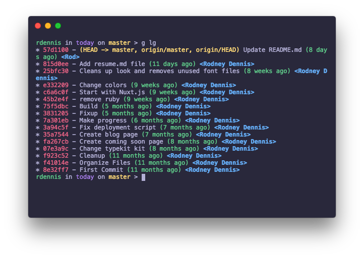

# whimsy-hyper

> A whimsical theme for [Hyper](https://hyper.is)

## Install
Add `whimsy-hyper` to the plugins list

```js
module.exports = {
  ...
  plugins: [
    'whimsy-hyper'
  ],
}
```

## Related
- [whimsy-iterm2](https://github.com/rod/whimsy-iterm2)
- [whimsy-terminal](https://github.com/rod/whimsy-terminal)

## License
MIT @ [Rodney Dennis](https://rod.today)
